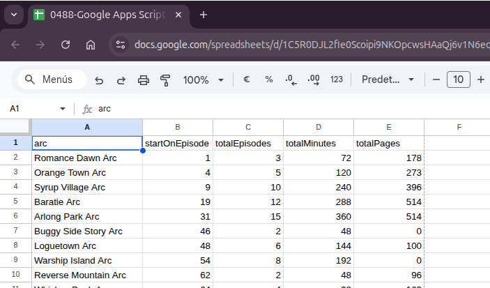
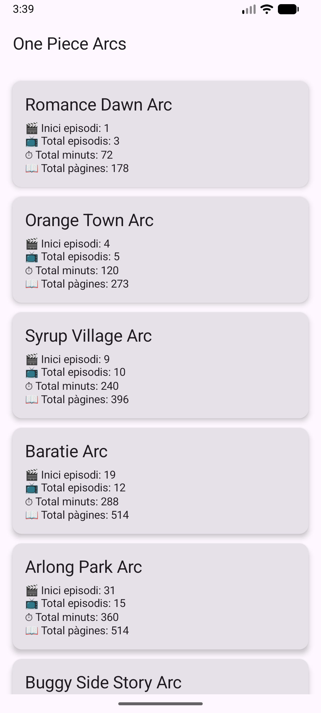

# Contingut
Aquest repo conté un projecte fet amb **Android Studio Narwhal 3 Feature Drop** amb Kotlin i Jetpack Compose per a prova de concepte del **consum d'una API** creada amb **JavaScript** a dins de **Apps Script** de **Google Sheets**.

Només conté la **implementació completa de la petició GET** de les dades d'una pestanya del document de Google Sheets.

# Captures
## Google Sheets

## Android App View
